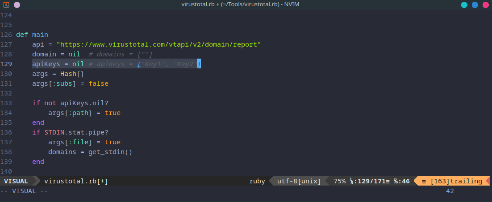

# Summary

A Ruby tool to fetch URLs associated with domains or subdomains from VirusTotal. Given a list of domains, it connects to the VirusTotal API, retrieves related URLs. The tool can handle rate limits by rotating through a list of API keys, ensuring continuous data retrieval without interruptions.

# Usage

-   **Linux**

```
cp virustotal.rb ~/.local/bin

```

-   Options

```
Usage: ./virustotal.rb [options]
    -f, --file FILE                  File that contain domains
    -s, --[no-]subs                  Take subdomains from given domains
    -p, --path PATH                  File path that contain apiKeys

```

-   Inlude domain siblings from virustotal

```
virustotal.rb -f domains --subs -p apiKeys.txt

```

OR

```
cat domains | virustotal.rb --subs  -p apiKeys.txt

```

-   Fetch urls only give subdomain or domains.

```
virustotal.rb -f domains -p apikeys.txt

```

OR

```
cat domains | virustotal.rb -p apiKeys.txt

```

-   You can pass api keys as argument or declare in source

```
cat domain | virustotal -p apikeys

```

OR

```
vim virustotal.rb



```
